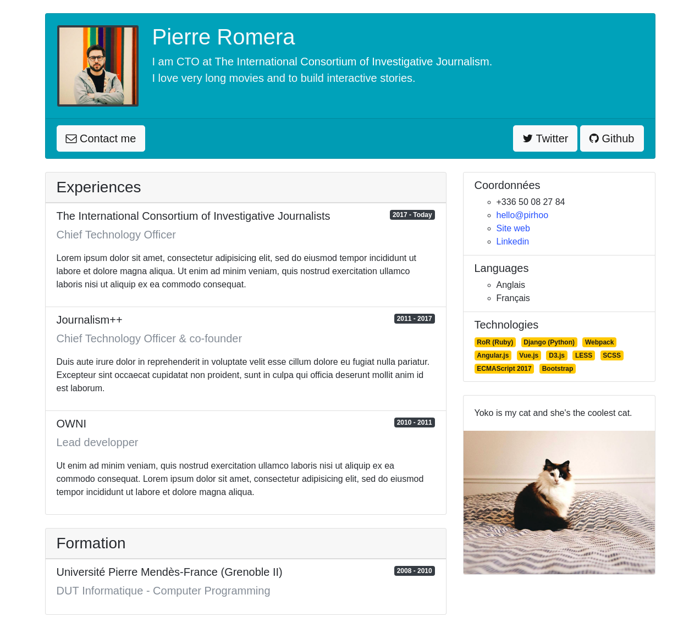

# session-7

Devenez autonomes avec Bootstrap.

## Construisez votre CV

L'objectif de cet exercice et de vous laisser en place votre CV à l'aide de
Bootstrap sans écrire aucune ligne de CSS. Voici le modèle à observer:

### Par où commencer ?

Vous pouvez commencer par reviser un peu le cours de la semaine dernière pour
en savoir plus sur [la grille de Bootstrap](https://github.com/edj-initiation-code/session-6#la-grille).
Une fois que vous avez bien compris cette notion, vous essayez de placer les éléments
principaux de votre page :

* l'en-tête (avec une phrase d'introduction et des boutons de contact)
* les deux colonnes principales de gauche (experience, formation) et de droite (coordonées, langues, etc).

Je vous recommande également de garder sous le coude [la documentation de Bootstrap](https://getbootstrap.com/docs/4.0/getting-started/introduction/)
qui contient des explications très détaillées sur le fonctionnement [des cards](https://getbootstrap.com/docs/4.0/components/card/),
des utilitaires [pour manipuler des couleurs](https://getbootstrap.com/docs/4.0/utilities/colors/),
ou encore des utilitaires [de margin/padding](https://getbootstrap.com/docs/4.0/layout/utilities-for-layout/#margin-and-padding).

Bootstrap est une librairie extrêment complète et son utilisation est tellement
répandue qu'elle devient presque un standard de mise en forme. N'hésitez pas à
prendre le temps de lire sa documentation en détail pour découvrir les nombreux
composants qu'elle vous offre.

### FontAwesome

Comme vous pouvez l'observer, ce CV contient des icônes sur les butons email, Github et Twitter.
Ces icônes sont obtenues grâce à la librairie [FontAwesome](http://fontawesome.io) qui
vous permet d'insérer une multitude d'icônes dans votre page sans jamais utiliser d'image.

Ces icônes peuvent être redimensionnées, collorées ou empilées puisque elles sont générées à
l'aide d'une typographie personnalisée et définies via des classes CSS. Je vous laisse jeter un
œil à [la documentation](http://fontawesome.io/get-started/) pour comprendre comment
l'utiliser sur votre CV.
